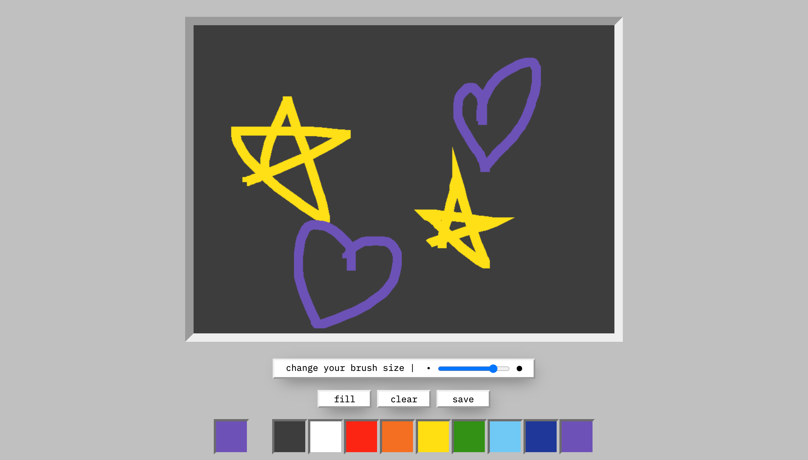

# VanillaJS-Paint

making a paint app using Vanilla JS

- Fill with one colour
- Change the brush size
- Change colours for filling and painting
- Clear the screen
- Save your painting as png file

[github-pages](https://minapark127.github.io/VanillaJS-Paint/)

### Sample pages

|                        **Home**                        |
| :----------------------------------------------------: |
|  |
|                       **Paint**                        |
|    |
